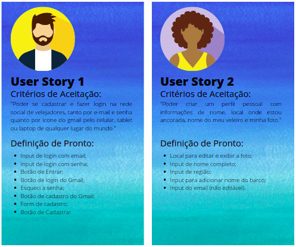
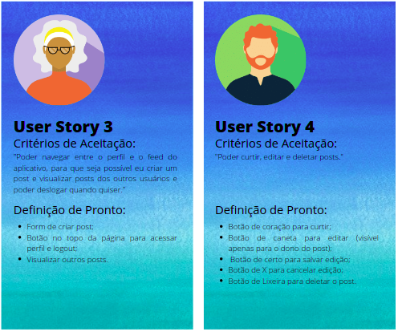
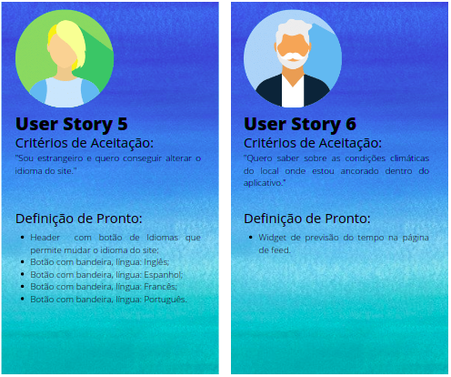

<h1 align='center'>
Criando uma   Rede Social
</h1
>
## Índice

- [Prefácio](prefácio)
- [Idealização do Pojeto](idealização-do-projeto)
- [3. Objetivos de aprendizagem](#3-objetivos-de-aprendizagem)
- [4. Considerações gerais](#4-considerações-gerais)
- [5. Critérios de aceitação mínimos do projeto](#5-criterios-de-aceitação-mínimos-do-projeto)
- [6. Hacker edition](#6-hacker-edition)
- [7. Entrega](#7-entrega)
- [8. Guias, dicas e leituras complementares](#8-guias-dicas-e-leituras-complementares)

---

<h1 align='center'>
Prefácio
</h1>

Este produto foi desenvolvido para ser o terceiro projeto do Bootcamp do [Laboratoria Brasil](https://www.laboratoria.la/br) Classe 06!  

O desafio apresentado foi criar uma rede social, com escolha livre de tema, utilizando-se de <b>_Vanilla JavaScript_</b> para criar uma aplicação SPA (_Single Page Aplication_) e trabalhar com a base de dados em tempo real da Google, o [Firebase](https://firebase.google.com/products/database/) além de ser responsiva.  
Essa Rede Social deverá permitir à qualquer usuário <b>_criar uma conta de acesso_</b>,
<b>_logar-se_</b> com ela, <b>_criar_</b>, <b>_editar_</b>, <b>_deletar_</b> suas próprias publicações e dar <b>_likes_</b> em publicações de outros usuários.  

<h1 align='center'>
Idealização do Projeto  
</h1>

A partir dessa proposta, nasceu o  

  

<h2 align='center'>
Por Que A\Bordo?
</h2>

Com a pandemia, cresceu ainda mais o número de pessoas que decidiram sair de suas casas em terra firme para morar em veleiros.  

Como mostram os artigos da [CNN Brasil](https://www.cnnbrasil.com.br/business/com-barcos-casa-e-compartilhados-mercado-nautico-cresce-20-em-plena-pandemia/) e da [JovemPam](https://jovempan.com.br/programas/jornal-da-manha/impulsionado-pela-pandemia-mercado-de-barcos-cresce-30-em-2020.html), este estilo de vida cresceu entre 20% e 30% entre os anos de 2020 e 2021 e o próprio canal do Youtube [#Sal](https://www.youtube.com/channel/UCj8_DeCUB0uL4cJwFmiQfMQ) atiça a curiosidade daqueles que querem se mudar para o mar com uma coleção de histórias de pessoas que decidiram morar em veleiros sozinhos, acompanhados ou até mesmo com suas famílias.  

Notou-se então que não existia uma rede exclusiva que conecta-se essa comunidade crescente de velejadores, com exceção de grupos no Facebook, e que possibilitasse a troca de experiências, convívio quando ancorados em lugares próximos e até mesmo venda/troca de peças.  

E com base nessas e outras informações e para resolver esse problema, o A\Bordo começou a ser desenvolvido, Uma colaboração entre:  

Jennifer Pessoa [Github](https://github.com/jenniferpessoa) / [LinkedIn](https://www.linkedin.com/in/jennifer-pessoa/);  
Letícia Oliveira [Github](https://github.com/LethsOliveira) / [LinkedIn](https://www.linkedin.com/in/leticia-s-alves/);  
Sabrina Araújo [Github](https://github.com/sabrinaaraujo-ds) / [LinkedIn](https://www.linkedin.com/in/sabrina-araujo-ds/);  

<h2 align='center'> 
Histórias de Usuário
</h2>

Com base nestas pesquisas e ao identificar a necessidade de nosso produto para os usuários, ao longo do projeto, criamos as 8 _User Stories_ a seguir para representar o que o usuário quer ver e fazer durante a utilização do produto.  

  

  

  

  

  

Todos as histórias tiveram como premisa as seguintes características para serem finalizadas e obterem em sua _Definição de Pronto_ a inclusão dos seguintes pontos:  

:heavy_check_mark: Ser Responsiva;  
:heavy_check_mark: Realizar os Testes Unitários;  
:heavy_check_mark: Receber revisão de código da equipe;  
:heavy_check_mark: Realizar testes manuais buscando erros e imperfeições simples.   

## 3. Objetivos de aprendizagem

O objetivo principal de aprendizagem deste projeto é construir uma [Single-page
Application
(SPA)](https://pt.wikipedia.org/wiki/Aplicativo_de_p%C3%A1gina_%C3%BAnica)
[_responsiva_](../../topics/css/02-responsive) (com mais de uma tela/ página) na
qual seja possível **ler e escrever dados.**

### HTML e CSS

:heavy_check_mark: HTML semântico  
:heavy_check_mark: CSS `flexbox`

### DOM e Web APIs
:heavy_check_mark: Manipulação do DOM  
:heavy_check_mark: History API  
:heavy_check_mark: localStorage

### Javascript
:heavy_check_mark: Uso de callbacks  
:heavy_check_mark: Consumo de Promises  
:heavy_check_mark: Uso de ES modules: `import` | `export`
### Firebase
:heavy_check_mark: Firestore  
:heavy_check_mark: Firebase Auth  
:heavy_check_mark: Firebase security rules  
:heavy_check_mark: Uso de onSnapshot | onAuthStateChanged  
:heavy_check_mark: Firebase Storage  
### Testing
:heavy_check_mark: Teste unitários  
 Testes assíncronos  
:heavy_check_mark: Mocking

### Git e Github
:heavy_check_mark: Colaboração pelo Github  
:heavy_check_mark: Organização pelo Github

### Boas práticas de programação
:heavy_check_mark: Criação de Boilerplate  
:heavy_check_mark: Modularização  
:heavy_check_mark: Nomenclatura / Semântica  
:heavy_check_mark: Linting  

---
----------------------------------CONTINUAR DAQUI--------------------------

### 5.4 Desenho da Interface de Usuário (protótipo de baixa fidelidade)

Você deve definir qual será o fluxo que o usuário seguirá dentro do seu
aplicativo e, com isso, criar a interface do usuário (UI) que siga este fluxo.
### 5.5 Responsivo

Deve funcionar bem em dispositivos de tela grande (computadores, laptops etc.) e
pequena (_tablets_, telefones celulares etc.). Sugerimos seguir a técnica
_`mobile first`_ (mais detalhes sobre essa técnica ao final).

### 5.6 Considerações sobre o comportamento da Interface do Usuário (UI)

Essas considerações ajudarão você a escrever as definições de pronto de sua
H.U.:

### 5.8 Considerações técnicas UX

- Faça pelo menos 2 entrevistas com os usuários.
- Faça um protótipo de baixa fidelidade.
- Verifique se a implementação do código segue as diretrizes do protótipo.
- Faça sessões de teste de usabilidade com o produto em HTML.
### 8.2. Mobile first

O conceito de [_mobile
first_](https://tableless.com.br/mobile-first-a-arte-de-pensar-com-foco/) faz
referência a um processo de desenho e desenvolvimento que parte de como se vê e
como funciona uma aplicação primeiro em um dispositivo móvel e mais adiante se
analisa como adaptar a aplicação à telas progressivamente maiores. Esta é uma
contraposição ao modelo tradicional, no qual primeiro se desenha os websites (ou
webapps) para desktops e depois os adaptam para telas menores.

A motivação aqui é se assegurar que desde o começo sejam desenhadas telas
_responsivas_. Dessa forma, começamos com a aparência e o comportamento do
aplicativo em uma tela e ambiente móvel.
