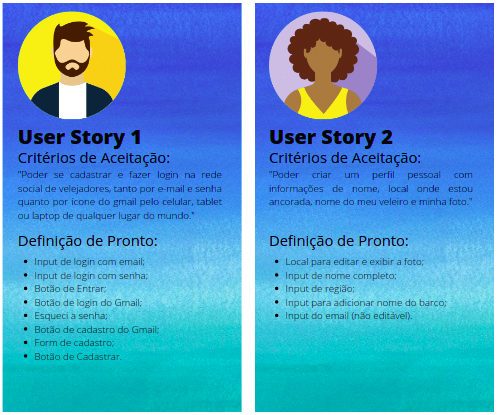
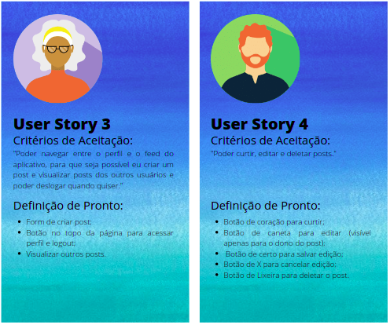
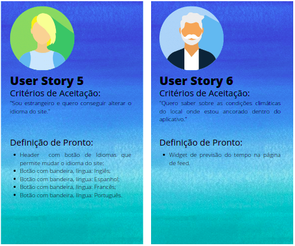
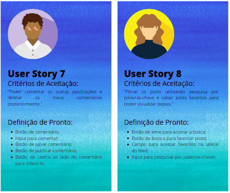
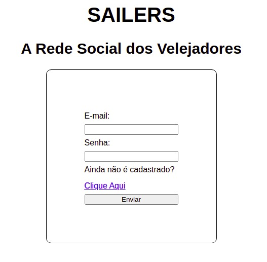
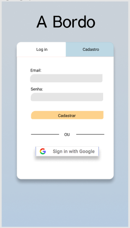
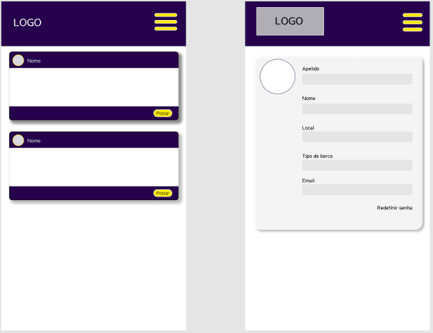
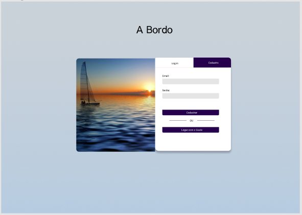
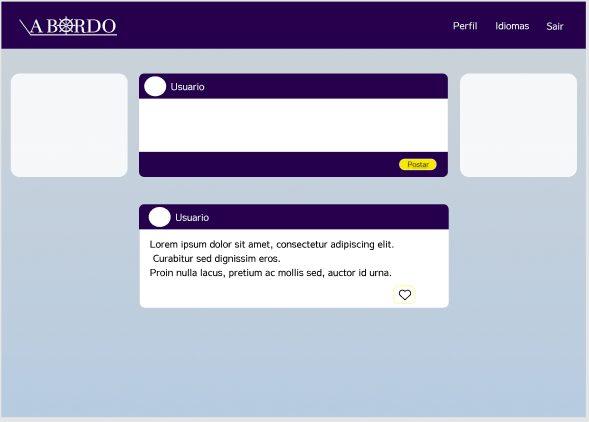

<h1 align='center'>

Desenvolver uma Rede Social
</h1>

<h3>
Índice
</h3>

- [Prefácio](#prefácio)
- [Idealização do Pojeto](#idealização-do-projeto)
- [Por Que A\Bordo?](#por-que-a\bordo)
- [Histórias de Usuário](#histórias-de-usuário)
- [Interface do Usuário](#interface-do-usuário)
- [Protótipo de Baixa Fidelidade e Teste de Usabilidade](#protótipo-de-baixa-fidelidade-e-teste-de-usabilidade)
- [Protótipos de Alta Fidelidade](#protótipos-de-alta-fidelidade)
- [Produto Final: Conhecendo o A\Bordo](#produto-final:-conhecendo-o-A\Bordo)
- [Aprendizagem Utilizada em Projeto](#aprendizagem-utilizada-em-projeto)
---

<h1 align='center'>
Prefácio
</h1>

Este produto foi desenvolvido para ser o terceiro projeto do Bootcamp do [Laboratoria Brasil](https://www.laboratoria.la/br) Classe 06!  

O desafio apresentado foi criar uma rede social, com escolha livre de tema, utilizando-se de <b>_Vanilla JavaScript_</b> para criar uma aplicação SPA (_Single Page Aplication_) e trabalhar com a base de dados em tempo real da Google, o [Firebase](https://firebase.google.com/products/database/) além de ser responsiva.  
Essa Rede Social deverá permitir à qualquer usuário <b>_criar uma conta de acesso_</b>,
<b>_logar-se_</b> com ela, <b>_criar_</b>, <b>_editar_</b>, <b>_deletar_</b> suas próprias publicações e dar <b>_likes_</b> em publicações de outros usuários.  

<h1 align='center'>
Idealização do Projeto  
</h1>

A partir dessa proposta, nasceu o  

  

<h2 align='center'>
Por Que A\Bordo?
</h2>

Com a pandemia, cresceu ainda mais o número de pessoas que decidiram sair de suas casas em terra firme para morar em veleiros.  

Como mostram os artigos da [CNN Brasil](https://www.cnnbrasil.com.br/business/com-barcos-casa-e-compartilhados-mercado-nautico-cresce-20-em-plena-pandemia/) e da [JovemPam](https://jovempan.com.br/programas/jornal-da-manha/impulsionado-pela-pandemia-mercado-de-barcos-cresce-30-em-2020.html), este estilo de vida cresceu entre 20% e 30% entre os anos de 2020 e 2021 e o próprio canal do Youtube [#Sal](https://www.youtube.com/channel/UCj8_DeCUB0uL4cJwFmiQfMQ) atiça a curiosidade daqueles que querem se mudar para o mar com uma coleção de histórias de pessoas que decidiram morar em veleiros sozinhos, acompanhados ou até mesmo com suas famílias.  

Notou-se então que não existia uma rede exclusiva que conecta-se essa comunidade crescente de velejadores, com exceção de grupos no Facebook, e que possibilitasse a troca de experiências, convívio quando ancorados em lugares próximos e até mesmo venda/troca de peças.  

E com base nessas e outras informações e para resolver esse problema, o A\Bordo começou a ser desenvolvido, Uma colaboração entre:  

Jennifer Pessoa [Github](https://github.com/jenniferpessoa) / [LinkedIn](https://www.linkedin.com/in/jennifer-pessoa/);  
Letícia Oliveira [Github](https://github.com/LethsOliveira) / [LinkedIn](https://www.linkedin.com/in/leticia-s-alves/);  
Sabrina Araújo [Github](https://github.com/sabrinaaraujo-ds) / [LinkedIn](https://www.linkedin.com/in/sabrina-araujo-ds/);  

<h2 align='center'> 
Histórias de Usuário
</h2>

Com base nestas pesquisas e ao identificar a necessidade de nosso produto para os usuários, ao longo do projeto, criamos as 8 _User Stories_ a seguir para representar o que o usuário quer ver e fazer durante a utilização do produto.  

  

  

  

  

  

Todos as histórias tiveram como premisa as seguintes características para serem finalizadas e obterem em sua _Definição de Pronto_ a inclusão dos seguintes pontos:  

:heavy_check_mark: Ser Responsivo;  
:heavy_check_mark: Realizar os Testes Unitários;  
:heavy_check_mark: Receber revisão de código da equipe;  
:heavy_check_mark: Realizar testes manuais buscando erros e imperfeições simples.   

<h1 align='center'>
Interface do Usuário  
</h1>  

<h2 align='center'> 
Protótipo de Baixa Fidelidade e Teste de Usabilidade
</h2>  

Após definido o tema de nosso produto, desenhamos um protótipo de baixa fidelidade, cujo o objetivo é desenhar um fluxo que o usuário seguiria para acessar o aplicativo.  

  

  

Inicialmente, o <b color='blue'>A\Bordo</b> se chamava Sailers de modo paleativo e este protótipo de baixa fidelidade seguiu para o teste de usabilidade, onde recebemos diversos feedbacks reordenando os botões e textos e então, foi definida uma interface do usuário (UI) para o protótipo de alta fidelidade, seguindo o fluxo de forma mais intuitiva e ordenada.  

<h2 align='center'> 
Protótipos de Alta Fidelidade
</h2>  

Considerando que a maior parte da população acessa suas aplicações pelo celular em qualquer lugar do mundo com sinal de rede (ou Wifi), os protótipos de alta fidelidade seguiram a linha de responsividade _Mobile First_ durante o design, e assim ir se desenvolvendo para aparelhos maiores.  

  

  

  

  

E ao pensar em uso em tablets grandes e computadores, decidimos por manter a interface leve e clean, desenvolvendo o produto para ser carregado de forma eficiente e sem muitas informações extras.  

  

  

  

  

<h2 align='center'> 
Produto Final: Conhecendo o A\Bordo
</h2>  

E assim, por fim, o [A\Bordo - Rede Social dos Velejadores]() veio ao mundo como o mais prazeroso e difícil desafio enfrentado até então por todas as colaboradoras.  
Este projeto foi realizado com muito carinho e total dedicação e nenhum percalço foi capaz de impedir sua finalização.

Conheça um pouco mais da versão para celulares.

  

   

  

  

  

   

E da versão para computadores.  

  

   

  

  

  

  

<h1 align='center'>
Aprendizagem Utilizada em Projeto
</h1> 

### HTML e CSS

:heavy_check_mark: HTML semântico  
:heavy_check_mark: CSS `flexbox`

### DOM e Web APIs
:heavy_check_mark: Manipulação do DOM  
:heavy_check_mark: History API  
:heavy_check_mark: localStorage

### Javascript
:heavy_check_mark: Uso de callbacks  
:heavy_check_mark: Consumo de Promises  
:heavy_check_mark: Uso de ES modules: `import` | `export`
### Firebase
:heavy_check_mark: Firestore  
:heavy_check_mark: Firebase Auth  
:heavy_check_mark: Firebase security rules  
:heavy_check_mark: Uso de onSnapshot | onAuthStateChanged  
:heavy_check_mark: Firebase Storage  
### Testing
:heavy_check_mark: Teste unitários  
 Testes assíncronos  
:heavy_check_mark: Mocking

### Git e Github
:heavy_check_mark: Colaboração pelo Github  
:heavy_check_mark: Organização pelo Github

### Boas práticas de programação
:heavy_check_mark: Criação de Boilerplate  
:heavy_check_mark: Modularização  
:heavy_check_mark: Nomenclatura / Semântica  
:heavy_check_mark: Linting  
